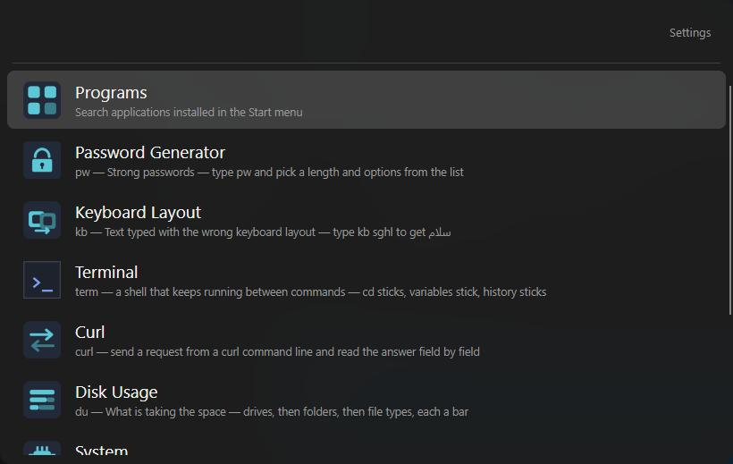
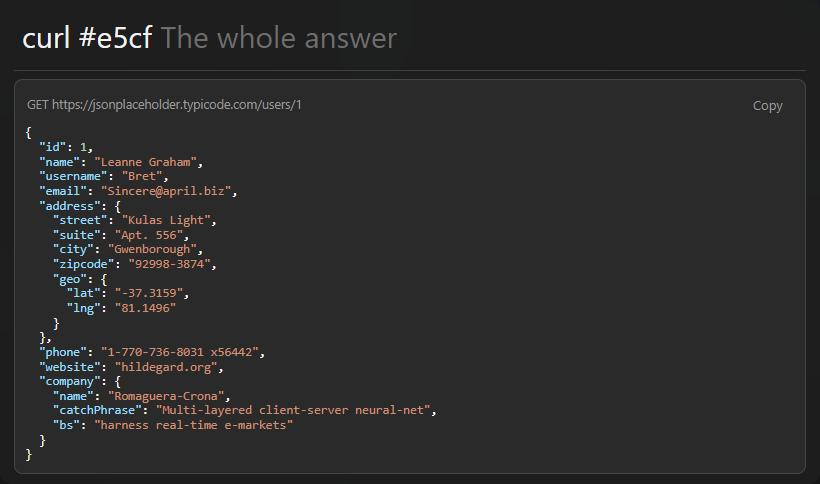
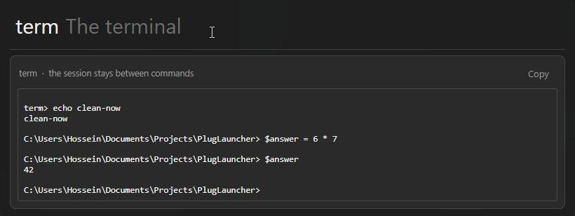
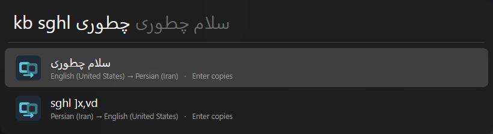

# PlugLauncher

<p align="center">
  
</p>

A fast, quiet launcher for your keyboard. Press **Alt+Space**, type a few letters, press
**Enter** — that's the whole idea. It sits in the tray and stays out of your way until you call
it.

Everything it can do comes from **plugins**. Three ship with it so it is useful the moment you
install it, and a built-in store adds more with one click each.

```
Alt+Space    →  the window opens
(empty)      →  your plugins, most recently used first
type         →  results from every plugin that matches
Enter        →  run   |   Tab: complete   |   ↑↓: select   |   Esc: close
```

It also speaks your keyboard: type on the wrong layout and it searches what you *meant* —
«زاقخپث» is found as `chrome`, and `sghl` offered back as `سلام`. Tab fixes the box in place.

## What it looks like

**A curl command, answered in place** — paste a request, press Enter twice, and the JSON comes
back pretty-printed and colored like an editor, with a copy button in the corner. Fields you
look for often can be picked one by one, and everything you sent stays in a list.

<p align="center">
  
</p>

**A terminal that remembers** — `term` runs commands in one shell that stays alive, so `cd`,
variables and everything else a shell keeps survive from one command to the next, however far
apart you type them. The whole session reads like a small terminal.

<p align="center">
  
</p>

**The wrong keyboard layout, fixed** — type `kb` and the text you typed on the wrong layout;
mixed Persian and English in one line works too.

<p align="center">
  
</p>

## Download

The [Releases page](https://github.com/mul83rry/PlugLauncher/releases) has two downloads of the
same build — take either:

| | |
|---|---|
| `PlugLauncher-<version>-setup.exe` | Installer. Start menu shortcut, an entry in Add or remove programs, upgrades in place. Installs per user under `%LOCALAPPDATA%\Programs`, so it never asks for administrator rights. |
| `PlugLauncher-<version>-win-x64.zip` | Portable. Extract anywhere, run `PlugLauncher.exe`, delete the folder to be rid of it. |

Neither one needs administrator rights. The app writes to `%APPDATA%\PlugLauncher` and, only if
you turn on **Start with Windows**, to `HKCU\...\CurrentVersion\Run` — nothing else.

**Requirement: [.NET 10 Runtime (x64)](https://dotnet.microsoft.com/download/dotnet/10.0)** —
the runtime, not the SDK. The plain **.NET Runtime**, `x64`, is enough; the *Desktop Runtime*
works too and includes it. .NET 9 or older will not work: the app does not roll forward across a
major version.

The installer checks for the runtime and offers the download page before it copies anything. If
you take the zip instead, Windows shows a dialog with a download link the first time you start
the app.

> **First run:** nothing here is code signed, so SmartScreen shows a blue "Windows protected
> your PC" box — for the installer and for the app. Click **More info → Run anyway**. The
> `SHA256SUMS.txt` attached to each release covers both downloads, so you can check what you
> got against it.

## Everyday use

- **Open it:** `Alt+Space`. **Close it:** `Esc`, or just click anywhere else. Closing the window
  only hides it — the app stays in the tray so the hotkey keeps working.
- **Quit for real:** the tray icon → **Exit**, or the **Exit PlugLauncher** button in settings.
- On the first run it asks whether to start with Windows, and never asks again. The
  **Start with Windows** checkbox in settings is where you change your answer.
- The hotkey itself can be changed in settings.

### Updates

Once a day PlugLauncher asks GitHub whether a newer release exists. If there is one, a tray
notification names it and the **Settings** button keeps a dot until you restart. Nothing is
downloaded or installed — the button opens the release page, and you upgrade the same way you
installed. The check is one request to `api.github.com`, it carries nothing about you, and
settings has a **Check now** button and a **Check automatically** checkbox to switch it off.

## What comes with it

Three plugins ship in the box, so a fresh install is useful immediately without being full of
things you did not ask for:

| Keyword | Plugin | What it does |
|---|---|---|
| *(none)* | Programs | Start menu shortcuts — type a name, Enter opens it |
| *(none)* | Calculator | Type any math expression, Enter copies the result |
| `pw` | Password Generator | Length, character sets, PIN and hex modes |

The rest are in the **store** tab in settings, one click each — the store greys out anything
your version of the launcher cannot run, so what it offers always works:

| Keyword | Plugin | What it does |
|---|---|---|
| `term` | Terminal | One shell that stays alive between commands — `cd` sticks, variables stick, history sticks |
| `curl` | Curl | Paste a curl command, get the answer in place: pretty JSON in editor colors, or field by field |
| `kb` | Keyboard Layout | Text typed on the wrong layout — `kb sghl` gives `سلام`; mixed Persian/English works too |
| `st` | Steam Games | Finds and launches installed games |
| `ssh` | SSH Hosts | Hosts from `~/.ssh/config`, opens a terminal on the one you pick |
| `dev` | Dev Toolbox | uuid, base64, url, hashes, epoch, JSON, JWT, random bytes, slugs |
| `sys` | System | Lock, restart, Task Manager, Device Manager, and memory/disk/IP read-outs |
| `du` | Disk Usage | What is taking the space — drives, then folders, then kinds of file, each with a bar |
| *(none)* | Applications | Everything in `/Applications`, opened on Enter. macOS only |

## Where your data lives

Everything the app writes stays in one place, `%APPDATA%\PlugLauncher\`, and deleting that
folder undoes all of it:

| What | Where |
|---|---|
| Installed plugins | `%APPDATA%\PlugLauncher\plugins\` |
| Settings | `%APPDATA%\PlugLauncher\settings.json` |
| Plugins' own data (curl history, terminal history, …) | One folder per plugin under `%APPDATA%\PlugLauncher\data\` |
| Log | `%APPDATA%\PlugLauncher\logs\plugLauncher.log` |

No account, no telemetry, no server of ours anywhere in it.

## On a Mac

macOS works, but there is no download for it: an unsigned bundle is refused by Gatekeeper on any
machine that did not build it. So build it there yourself with the
[.NET 10 SDK](https://dotnet.microsoft.com/download/dotnet/10.0):

```bash
./tools/build-mac.sh
open publish/PlugLauncher.app
```

Build the bundle; do not `dotnet run` — a bare binary is not an application as far as the macOS
window server is concerned, and the hotkey will never fire. The details, and the Linux note, are
in [docs/DEVELOPING.md](docs/DEVELOPING.md).

## Come build a plugin

The whole app is plugins, and a plugin is just a folder with a script in it — no build step, no
DLLs, no SDK. If you can write a little C#, you can teach your launcher a new trick: a site you
open ten times a day, a number you always look up, a sentence you always paste wrong. Drop the
folder in `%APPDATA%\PlugLauncher\plugins\`, press **Reload** in settings, and it is live.

[docs/DEVELOPING.md](docs/DEVELOPING.md) walks through it, manifest to finished plugin.

## Contributing

We would love to have you. Bug reports, plugin ideas, translations of the README into your
language, a plugin you wrote that others could use — all of it counts, and all of it is
welcome:

- Something broke or behaves strangely? [Open an issue](https://github.com/mul83rry/PlugLauncher/issues) —
  the log at `%APPDATA%\PlugLauncher\logs\` usually tells the story, and attaching it helps.
- Want to change the app itself? [docs/DEVELOPING.md](docs/DEVELOPING.md) gets you building in
  two commands. Pull requests are read quickly and merged happily.
- Wrote a plugin? Put it in a repository of its own and tell us — the best ones graduate into
  the store so everyone gets them with one click.

And if PlugLauncher saves you a few seconds every day, a ★ on the repository is the cheapest
way to say so — it helps other people find it.

## License

[MIT](LICENSE). Copyright (c) 2026 Hosein Asadi.

---

Building from source, the release process, and the plugin API live in
[docs/DEVELOPING.md](docs/DEVELOPING.md). Development notes and the task log are in
[TASKS.md](TASKS.md) (Persian).
